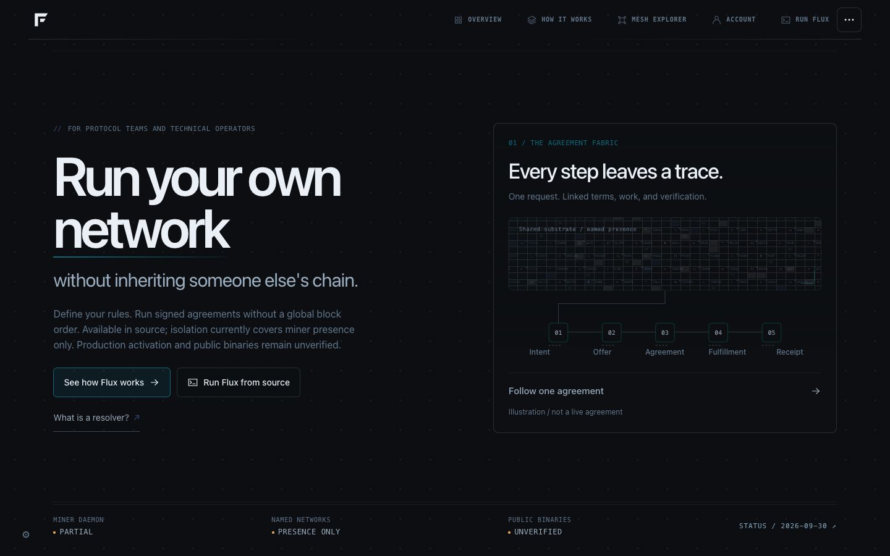

# Desktop Home approval checkpoint

The user requires confirmation of Home before further page redesign. Mobile is deferred to the end. Existing inner-page work remains provisional.

The original dense canvas field is cropped to the agreement panel. The five records and illustration boundary remain readable. The panel has a full-surface entry link; hover and keyboard focus trace its connection, emphasize the soft border, and move the native SVG arrow. Main/secondary actions, reference links, and header links have visible hover and keyboard states.

[Keyboard-focus view](home-focus.png) · [Expansion capture](home-expanding.png) · [Desktop geometry measurements](desktop-measurements.json)

Measurements at 1440 × 900, 1280 × 800, 1280 × 720, and 1024 × 768 show document and page dimensions equal to the viewport, all principal actions and status content inside it, and each stage label fitting its width. Browser verification proves the expanded host is the original NAV with computed opacity 1; returning removes the temporary host class and focuses “Follow one agreement.” The compact text uses a fixed-width wrapper during motion and new content lays out at destination size.

Regression checks: icons, panel continuity, page router, real route mounting, and conversion-copy boundaries pass. These establish the local behavior contracts; they do not establish user acceptance of the visual direction or completion of the full audit.

### Agreement panel refinement

The Home panel now connects the retained dense substrate to five distinct native SVG record symbols: request, offer, linked agreement, work artifact, and receipt. Rounded record surfaces, directional connectors, and sequential hover/focus emphasis communicate accumulation rather than decorative motion. The illustration remains explicitly non-live.

Verified at 1440 × 900 and 1280 × 720 with no document overflow, all five labels fitting, and the original NAV panel expanding into the dashboard then returning without leaving a continuity host. Route mounting (32 modules), panel continuity, native icon checks, and diff whitespace checks pass. Preview: `home-agreement-refined.png`. Home approval remains pending before further page redesign.

### DEFXN desktop header

Renamed the website identity to DEFXN with a native SVG D mark and visible wordmark, softly grouped navigation, a distinct Run DEFXN action, and current-page emphasis. The full index remains available through the existing menu. Updated site metadata and Home entry labels; technical source commands remain intact. Verified menu opening/closing, current-page selection, and desktop fit at 1440 × 900 and 1024 × 768. Navigation index, 32 route mounts, native icon checks, and whitespace checks pass. Preview: `defxn-home-header.png`.

### Individual cycle and mesh responses

Removed the whole-panel hover trigger and stretched link overlay. Each of the five record links now opens its corresponding lifecycle page and owns its hover/focus animation, local incoming connector, and explanation. Intent writes a request; Offer introduces terms; Agreement joins links; Fulfillment assembles the work artifact; Receipt traces the verification mark.

The retained dense mesh receives five native SVG signal overlays: request origin, offer route, converging agreement paths, bounded work scan, and registered receipt trace. They animate once on entry, clear when the interaction leaves, and obey reduced motion and the site's pause setting. These are illustrative responses, not live verification.

Browser checks verified five isolated keyboard responses, one mesh response per focused step, Agreement opening its own inner page through the retained NAV surface (opacity 1), reverse focus restoration, and no document overflow at 1440 × 900, 1280 × 720, and 1024 × 768. Route mounting and panel-continuity regression checks pass. Preview: `defxn-cycle-agreement-focus.png`. Home approval is still pending before broader page redesign.

### Popover overlap correction

The rendered legacy hash-link row remained behind the layered menu when clean-path routing created replacement links. The menu now detaches the original links, reuses them inside their matching groups, and updates their addresses to the active route format. Its surface is opaque and its bounded desktop height fits the complete index.

Regression checks cover legacy-link reuse in HTTP routing mode, absence of stray direct link children, and all 31 destinations. Browser checks verified the index, Understand and Read groups, reverse navigation, and complete index fit at 1024 × 768 with no document overflow. Preview: `defxn-navigation-fixed.png`.

### Correction: animate the substrate blocks themselves

This supersedes the SVG mesh-response approach above, which the user rejected. Removed the added cycle pictograms and all mesh SVG overlays. The cycle retains compact numbered records; hover/focus now repaints cells on the original lattice activity canvas, using the exact substrate cell spacing and the measured mesh crop.

Five bounded 850 ms responses affect the actual grid blocks: Intent expands a local cell cluster; Offer propagates two bands; Agreement converges two block groups; Fulfillment scans and fills a sparse work pattern; Receipt settles ordered rows. Pointer state takes priority over focus. Leaving clears the cells, changing steps cancels the previous animation, navigation clears it, and reduced motion/pause shows a static state. No random Home activity loop runs.

Browser checks confirmed five matching focus-driven canvas states, no SVG overlays or cycle glyphs, reset on exit, and 1280 × 720 zero-scroll. Screenshot: `defxn-mesh-blocks.png`.
